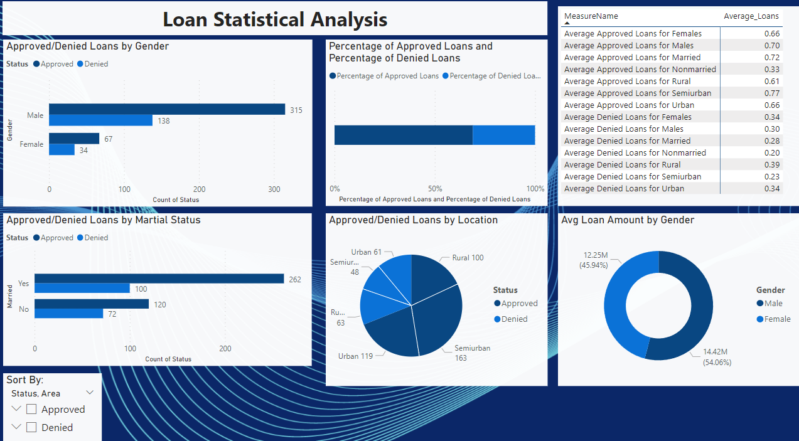
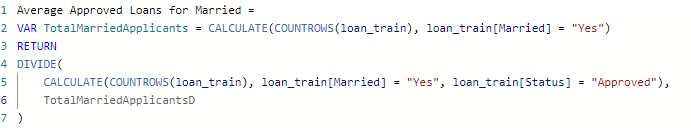
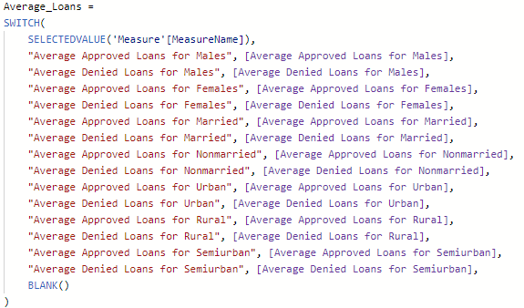

# Financial Analysis (with the use of Microsoft Power Bi)

# Overview:

Welcome to my personal project exploring financial information obtained from a dataset to identify any noteworthy discrepancies in loan approvals based on different factors such as gender, marital status, or location.

In order to access the Microsoft Power Bi Dashboard, you will need to sign in to your Microsoft account. 

Link to Microsoft Power Bi Dashboard: [Here](https://app.powerbi.com/reportEmbed?reportId=5092d22b-c407-466d-ac8d-5a912d3046de&autoAuth=true&ctid=a937ea12-13a6-4a54-ab0c-8c4526f8294c)

Picture of Dashboard below:

# Objectives

This project aims to answer three key questions related to loan approvals/denials:

**Research Question 1:**
Is there a significant difference in the approval rates for loan applications based on gender and marital status? Are there any differences in the loan amounts approved?

**Research Question 2:**
Does gender influence the average loan amount granted to applicants?

**Research Question 3:**
How does the geographical location (Rural, Urban, or Semiurban) impact the likelihood of loan approval or denial?
   
# Methodology:

1. Preprocessing:

Obtained dataset comprising random loan applications, their outcomes, and applicant information, including gender, marital status, loan amount, credit history, income level, employment status, and geographical location.

2. Data Preprocessing:
   
To ensure data quality, I filtered the dataset to remove instances where information was missing or null values were present. This was easily achieved using the Power Query Editor, where I sorted out missing values. I thought about changing that value of the missing data or the null values to 0 but thought using the filter more simplistic. Additionally, I transformed the 'Status' column from 0 and 1 to 'rejected' and 'approved,' respectively. As there was no documentation available on currency, I assumed the loan amount was in USD.

3. Data Analysis:
   
For this part of the process, exploratory data analysis was performed to gain insights into the distribution of loan approvals based on gender, marital status, and location.  Visualizations such as bar charts were used to represent approved and denied loans by gender and marital status. Interactive Slicer was added to sort by approved and denied loans. I also employed a pie chart to showcase the differences in approvals across the three geographical locations. To analyze the average loan amounts, a donut chart was used to visualize the average loan amount for both genders.

To create meaning, different measures were wrote to gain insight on this data. These measures were to obtain averages to see if there were any discrepencies. An example is shown below:

After the measures were created, a matrix visual was created. To present the data more effectively, a new table was generated to display the measure names alongside the data. This was done by

# Conclusion

After thorough analysis, I addressed the three questions originally posed:

**1. Is there a significant difference in the approval rates for loan applications based on gender and marital status? Are there any differences in the loan amounts approved?**

Conclusion: There was no significant discrepancy in approvals based on gender. However, it was interesting to note that the approvals for non-married borrowers were significantly lower compared to married borrowers or based on gender.

**2. Does gender influence the average loan amount granted to applicants?**

Conclusion: The average loan amount for males was 14.42 million USD, whereas for females, it was 12.25 million USD. Due to the small sample size (453 males vs. 101 females), it is challenging to draw concrete conclusions.

**3. How does the geographical location (Rural, Urban, or Semiurban) impact the likelihood of loan approval or denial?**

Conclusion: Both Rural and Urban areas showed similar approval patterns, while Semiurban areas displayed interesting results. Semiurban areas had 163 approvals and 48 denials, compared to 119 approvals and 61 denials for Urban areas, and 100 approvals and 63 denials for Rural areas. The approval average for Semiurban areas was over 10% higher than Urban areas.

# Data Sources

Data was obtained from: [Kaggle](https://www.kaggle.com/datasets/mirzahasnine/loan-data-set?resource=download&select=loan_train.csv)

If you have any questions or feedback on this project, feel free to reach out!
